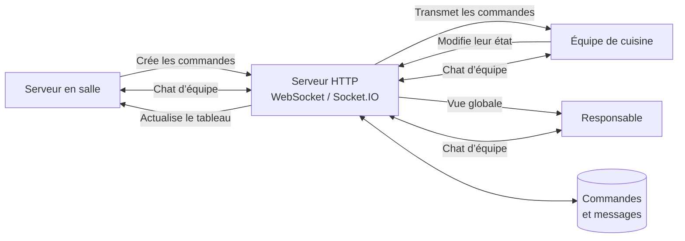
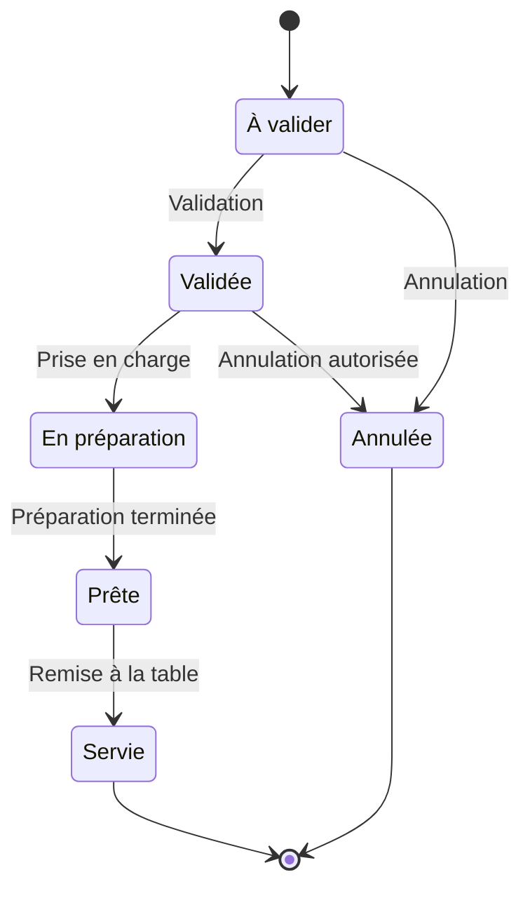
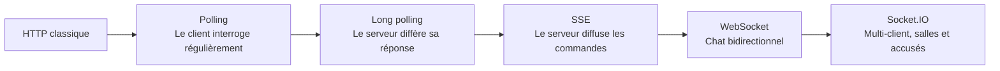
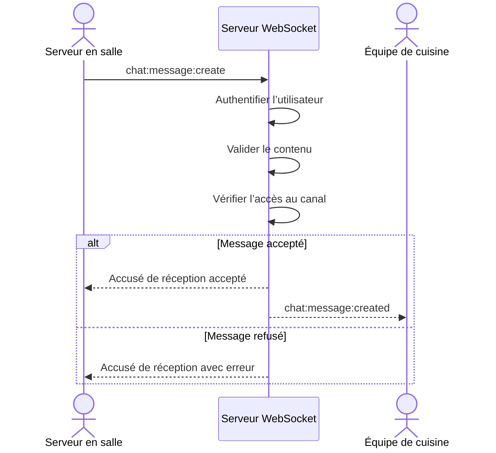
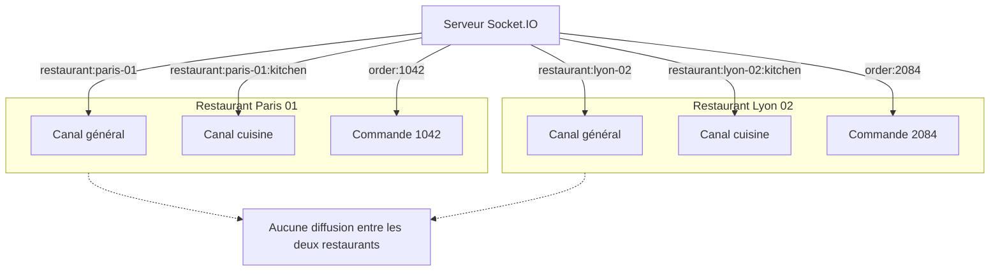

# Web Temps Réel — Master 2 Architecte logiciel / Informaticien web

## Séquence pédagogique : 3 × 3 heures

## Objectifs du module

À l’issue de cette séquence, les étudiants devront être capables de :

- naviguer efficacement dans les documentations officielles de MDN et de Socket.IO ;
- expliquer le modèle requête-réponse du protocole HTTP et ses conséquences sur les communications en temps réel ;
- comparer le polling, le long polling, les Server-Sent Events, WebSocket et Socket.IO ;
- sélectionner une technologie adaptée à un besoin client ;
- implémenter une communication temps réel unidirectionnelle ou bidirectionnelle ;
- organiser une communication entre plusieurs clients ;
- isoler les communications au moyen de canaux ou de salles ;
- distinguer une commande envoyée par un utilisateur d’un événement validé par le serveur ;
- justifier leurs choix d’architecture, leurs limites et les risques opérationnels associés.

## Projet fil rouge — Tableau de commandes d’un restaurant avec chat d’équipe

Les trois séances s’appuient sur une même application évolutive : un **tableau de commandes de restaurant complété par un chat en temps réel**.

L’application est utilisée simultanément par plusieurs catégories d’utilisateurs :

- les serveurs enregistrent les commandes depuis la salle ;
- l’équipe de cuisine consulte les commandes à préparer ;
- les cuisiniers modifient l’état des commandes ;
- les responsables supervisent l’ensemble du service ;
- les membres de l’équipe échangent au moyen d’un chat général ou d’une discussion associée à une commande.

### Fonctionnalités principales

Les utilisateurs peuvent :

- créer une commande pour une table ;
- consulter les commandes en cours ;
- voir immédiatement les nouvelles commandes ;
- faire évoluer une commande entre plusieurs états ;
- recevoir les changements d’état en temps réel ;
- envoyer et recevoir des messages dans un chat d’équipe ;
- ouvrir une discussion associée à une commande ;
- visualiser les connexions et déconnexions ;
- rejoindre uniquement les canaux auxquels leur rôle leur donne accès.

### Vue d’ensemble du projet



Tous les utilisateurs communiquent avec le serveur. Celui-ci valide les actions, conserve l’état métier et décide quels clients doivent recevoir chaque événement.

### Cycle de vie d’une commande



Le serveur reste responsable de la validation des transitions. Un client ne modifie jamais directement l’état partagé : il demande une transition, puis le serveur accepte ou refuse cette demande avant de publier l’événement correspondant.

### Progression pédagogique du projet

- Le **tableau de commandes** sert à étudier le polling, le long polling et les SSE.
- Le **chat d’équipe** introduit la communication bidirectionnelle avec WebSocket.
- Socket.IO réunit ensuite les deux fonctionnalités et permet de traiter la communication multi-client, les accusés de réception, les rôles et l’isolation par salles.



Cette progression permet de partir du fonctionnement connu de HTTP avant d’introduire progressivement la communication persistante et bidirectionnelle.

---

## Séance 1 — De HTTP au polling et au long polling

**Durée :** 3 heures  
**Question directrice :** Comment les différents postes d’un restaurant peuvent-ils obtenir rapidement les nouvelles commandes avec un protocole fondé sur des requêtes initiées par le client ?

### Objectifs pédagogiques

À l’issue de la séance, les étudiants devront être capables de :

- décrire le déroulement d’une requête et d’une réponse HTTP ;
- identifier les limites d’une application HTTP conventionnelle ;
- distinguer le polling du long polling ;
- implémenter ces deux mécanismes ;
- analyser la latence, le nombre de requêtes, la charge serveur et les erreurs possibles ;
- retrouver une information technique dans la documentation MDN.

### Déroulement

| Horaire | Activité | Contenu et résultat attendu |
|---|---|---|
| 0 h 00–0 h 20 | Introduction et diagnostic | Présentation du module et du projet de restaurant. QCM formatif sur HTTP, JavaScript, l’architecture client-serveur et la programmation asynchrone. |
| 0 h 20–0 h 50 | Fondamentaux de HTTP | Modèle requête-réponse, méthodes, codes de statut, en-têtes, connexions persistantes, cache, délais d’expiration et absence d’état. Observation des échanges dans les outils de développement du navigateur. |
| 0 h 50–1 h 10 | Analyse du besoin client | Identification des acteurs, des données échangées, de la latence acceptable, du trafic attendu et des conséquences d’une déconnexion pendant le service. |
| 1 h 10–1 h 20 | Pause | — |
| 1 h 20–1 h 50 | Polling | Rafraîchissement périodique du tableau de commandes avec `fetch`. Étude de l’intervalle, de la latence, des réponses redondantes et du coût réseau. |
| 1 h 50–2 h 20 | Long polling | Le serveur conserve la requête jusqu’à la création ou à la modification d’une commande. Implémentation d’un délai maximal et d’une reconnexion immédiate du client. |
| 2 h 20–2 h 45 | Expérience comparative | Mesure du nombre de requêtes et de la latence pour le polling et le long polling. Simulation d’un serveur temporairement indisponible. |
| 2 h 45–3 h 00 | Consolidation | Comparaison collective, recherche dans la documentation MDN et présentation des premiers éléments à intégrer au dossier. |

### Travaux pratiques

Les étudiants implémentent :

1. `GET /orders` pour récupérer les commandes en cours ;
2. un rafraîchissement automatique à intervalle régulier ;
3. `GET /orders/updates?after=<eventId>` pour le long polling ;
4. la création d’une commande avec `POST /orders` ;
5. la gestion des délais d’expiration et de la reconnexion ;
6. un indicateur visuel de l’état de la connexion.

### Exemple de commande

```json
{
  "tableNumber": 12,
  "items": [
    {
      "product": "Burger végétarien",
      "quantity": 2
    },
    {
      "product": "Eau gazeuse",
      "quantity": 1
    }
  ],
  "comment": "Sans oignons"
}
```

### Points d’architecture

- Le polling représente un compromis entre latence et consommation de ressources.
- Une fréquence élevée augmente le nombre de requêtes, même lorsqu’aucune commande n’a changé.
- Une requête de long polling doit toujours posséder un délai maximal.
- Les commandes et les événements doivent disposer d’identifiants stables.
- Une reconnexion peut provoquer la réception répétée d’un événement.
- Le traitement d’un événement doit donc être idempotent : recevoir deux fois le même événement ne doit pas créer deux commandes.
- Le serveur reste l’autorité sur les données du restaurant.

### Éléments à conserver pour le dossier

Chaque groupe conserve :

- un schéma du polling et du long polling ;
- une capture ou une trace des requêtes HTTP ;
- le nombre de requêtes et la latence approximative mesurés ;
- une comparaison argumentée des deux mécanismes ;
- les liens vers les pages MDN consultées.

---

## Séance 2 — Server-Sent Events, WebSocket et chat

**Durée :** 3 heures  
**Question directrice :** Pourquoi utiliser un flux unidirectionnel pour le tableau de commandes et une connexion bidirectionnelle pour le chat ?

### Objectifs pédagogiques

À l’issue de la séance, les étudiants devront être capables de :

- implémenter un flux SSE ;
- expliquer la reconnexion SSE et le rôle des identifiants d’événements ;
- expliquer l’établissement d’une connexion WebSocket ;
- implémenter un chat bidirectionnel avec WebSocket ;
- comparer SSE et WebSocket à partir de critères explicites ;
- identifier les principaux enjeux de fiabilité et de sécurité.

### Déroulement

| Horaire | Activité | Contenu et résultat attendu |
|---|---|---|
| 0 h 00–0 h 15 | Réactivation des connaissances | Reconstruction du cycle de vie du polling et du long polling. Correction collective des incompréhensions. |
| 0 h 15–0 h 45 | Server-Sent Events | `EventSource`, type `text/event-stream`, événements nommés, identifiants, reconnexion automatique et communication du serveur vers le navigateur. |
| 0 h 45–1 h 15 | Tableau de commandes avec SSE | Le serveur publie les créations et changements d’état. Les postes de cuisine reçoivent les mises à jour et se reconnectent après une interruption. |
| 1 h 15–1 h 25 | Pause | — |
| 1 h 25–1 h 55 | Protocole WebSocket | Négociation à partir de HTTP, connexion persistante, trames, duplex intégral, cycle de vie et distinction entre WebSocket et Socket.IO. |
| 1 h 55–2 h 30 | Chat avec WebSocket | Chaque utilisateur peut envoyer un message. Le serveur valide puis diffuse le message aux clients connectés. |
| 2 h 30–2 h 50 | Atelier sur les défaillances | Déconnexions, messages mal formés, doublons, client lent, taille maximale d’un message, expiration de l’authentification et reconnexion. |
| 2 h 50–3 h 00 | Exercice de décision | Les groupes justifient l’utilisation des SSE pour les commandes et de WebSocket pour le chat, puis étudient des solutions alternatives. |

### Travaux pratiques

Les étudiants implémentent :

1. un point d’entrée SSE pour les événements du tableau de commandes ;
2. un abonnement avec `EventSource` ;
3. des identifiants d’événements et un indicateur de reconnexion ;
4. un serveur WebSocket natif ;
5. l’envoi et la réception de messages dans le chat ;
6. l’affichage de l’auteur et de la date de chaque message ;
7. une validation élémentaire des messages entrants ;
8. un indicateur de connexion et de déconnexion du chat.

### Événements du tableau de commandes

```text
order:created
order:status-updated
order:cancelled
```

### Messages du chat

```json
{
  "type": "chat:message:create",
  "clientMessageId": "client-message-42",
  "channelId": "restaurant-general",
  "content": "La table 12 signale une allergie."
}
```

### Parcours d’un message dans le chat



Ce schéma souligne la différence entre :

- la **commande** `chat:message:create`, demandée par le client ;
- l’**événement** `chat:message:created`, publié par le serveur après validation ;
- l’**accusé de réception**, qui indique à l’émetteur si sa demande a été acceptée.

### Points d’architecture

#### Les SSE sont adaptés au tableau lorsque

- les mises à jour circulent principalement du serveur vers les postes du restaurant ;
- les événements sont textuels ;
- la reconnexion automatique est utile ;
- le navigateur doit reprendre les événements à partir du dernier identifiant reçu.

#### WebSocket est adapté au chat lorsque

- les utilisateurs envoient et reçoivent fréquemment des messages ;
- une faible latence est importante ;
- la connexion représente une session interactive ;
- le serveur doit pouvoir publier un message sans attendre une nouvelle requête HTTP.

#### Précautions indispensables

- authentifier la connexion initiale ;
- autoriser chaque action et chaque abonnement ;
- valider la structure des messages ;
- limiter leur taille et leur fréquence ;
- ne pas faire confiance au nom d’utilisateur transmis par le client ;
- gérer les reconnexions et les doublons ;
- distinguer les commandes envoyées par le client des événements publiés par le serveur.

### Éléments à conserver pour le dossier

Chaque groupe conserve :

- un diagramme de séquence SSE ;
- un diagramme de séquence WebSocket ;
- une trace de mise à jour du tableau de commandes ;
- une trace d’échange dans le chat ;
- la preuve d’un test de reconnexion ;
- le schéma d’au moins un événement métier ;
- un tableau de décision technologique ;
- les liens vers la documentation MDN consultée.

---

## Séance 3 — Socket.IO, multi-client, rôles et isolation

**Durée :** 3 heures  
**Question directrice :** Comment transmettre les commandes et les messages aux bons utilisateurs sans exposer les communications des autres équipes ou restaurants ?

### Objectifs pédagogiques

À l’issue de la séance, les étudiants devront être capables de :

- naviguer dans la documentation officielle de Socket.IO ;
- expliquer la différence entre WebSocket et Socket.IO ;
- implémenter des événements nommés ;
- gérer plusieurs clients simultanés ;
- utiliser les accusés de réception ;
- isoler les communications à l’aide de salles ;
- appliquer des droits différents selon le rôle de l’utilisateur ;
- concevoir un contrat d’événements temps réel.

### Déroulement

| Horaire | Activité | Contenu et résultat attendu |
|---|---|---|
| 0 h 00–0 h 20 | Revue d’architecture | Comparaison des mécanismes étudiés. Distinction entre protocole, API navigateur et bibliothèque. |
| 0 h 20–0 h 50 | Fondamentaux de Socket.IO | Connexion, événements nommés, accusés de réception, reconnexion, diffusion, salles, espaces de noms et intergiciels. |
| 0 h 50–1 h 20 | Migration vers Socket.IO | Remplacement du WebSocket natif par Socket.IO en conservant les contrats métier du chat et des commandes. |
| 1 h 20–1 h 30 | Pause | — |
| 1 h 30–2 h 05 | Communication multi-client | Connexion simultanée d’un serveur, d’un poste de cuisine et d’un responsable. Diffusion des commandes, messages, accusés de réception et gestion de la présence. |
| 2 h 05–2 h 35 | Isolation et autorisation | Création de salles par restaurant, zone de préparation ou commande. Vérification des droits avant l’entrée dans une salle et avant chaque action métier. |
| 2 h 35–2 h 50 | Défi d’architecture | Étude du passage à plusieurs instances serveur : sessions persistantes, adaptateur partagé, propriété de l’état, observabilité et modes de défaillance. |
| 2 h 50–3 h 00 | Démonstration et préparation de l’évaluation | Démonstration avec plusieurs clients et présentation d’une décision d’architecture par groupe. |

### Organisation proposée des salles

```text
restaurant:<restaurantId>
restaurant:<restaurantId>:kitchen
restaurant:<restaurantId>:service
order:<orderId>
```

Exemples :

```text
restaurant:paris-01
restaurant:paris-01:kitchen
restaurant:paris-01:service
order:order-1042
```

### Isolation des communications



Une salle est uniquement un mécanisme de diffusion. Elle ne remplace pas la vérification des droits.

Le serveur doit vérifier :

- l’identité de l’utilisateur ;
- son appartenance au restaurant ;
- son rôle ;
- son droit d’accéder à la commande ;
- son droit d’effectuer la transition demandée.

### Rôles proposés

| Rôle | Actions principales |
|---|---|
| Serveur | Créer une commande, consulter les commandes de ses tables, envoyer des messages |
| Cuisine | Consulter les commandes validées, passer une commande en préparation puis prête |
| Responsable | Consulter toutes les commandes, annuler une commande, accéder à tous les canaux |
| Administrateur | Gérer les utilisateurs et les restaurants, sans intervenir nécessairement dans le service |

### Contrats d’événements

#### Création d’une commande

Commande envoyée par le client :

```text
order:create
{
  restaurantId,
  tableNumber,
  items,
  comment,
  clientOrderId
}
```

Événement publié par le serveur :

```text
order:created
{
  eventId,
  orderId,
  restaurantId,
  tableNumber,
  items,
  comment,
  status,
  createdBy,
  createdAt
}
```

Accusé de réception :

```text
{
  accepted,
  orderId?,
  errorCode?
}
```

#### Modification de l’état

Commande envoyée par le client :

```text
order:status:update
{
  orderId,
  expectedStatus,
  requestedStatus
}
```

Événement publié par le serveur :

```text
order:status-updated
{
  eventId,
  orderId,
  previousStatus,
  status,
  updatedBy,
  updatedAt
}
```

Le champ `expectedStatus` permet au serveur de détecter qu’un autre utilisateur a déjà modifié la commande.

#### Envoi d’un message

Commande envoyée par le client :

```text
chat:message:create
{
  channelId,
  clientMessageId,
  content
}
```

Événement publié par le serveur :

```text
chat:message:created
{
  eventId,
  messageId,
  channelId,
  author,
  content,
  createdAt
}
```

### Travaux pratiques

Les étudiants implémentent :

1. un serveur et un client Socket.IO ;
2. le tableau de commandes partagé ;
3. le chat général du restaurant ;
4. un chat associé à une commande ;
5. des événements métier nommés ;
6. des accusés de réception ;
7. une salle par restaurant et par commande ;
8. une vérification des droits côté serveur ;
9. un test avec au moins trois clients ;
10. un test d’isolation entre deux salles ;
11. des indicateurs de connexion, de déconnexion et d’erreur.

### Points d’architecture

- Socket.IO n’est pas le protocole WebSocket.
- Une salle contrôle la destination d’un événement, pas l’autorisation d’y accéder.
- Les données d’identité ne doivent pas provenir directement du contenu d’un message client.
- Le serveur valide les transitions d’état des commandes.
- Les noms d’événements et leurs données constituent un contrat applicatif.
- Les accusés de réception confirment le traitement d’une commande, mais ne remplacent pas la publication d’un événement métier.
- Une reconnexion peut nécessiter une resynchronisation complète du tableau.
- Le chat et les commandes peuvent partager le même transport tout en conservant des contrats métier distincts.
- Le déploiement sur plusieurs instances nécessite une coordination entre les serveurs.
- La présence en ligne ne doit pas être considérée comme une donnée métier durable sans stratégie explicite de persistance.

### Éléments à conserver pour le dossier

Chaque groupe conserve :

- le catalogue des événements client-serveur ;
- le cycle de vie d’une commande ;
- le modèle de rôles et d’autorisations ;
- l’organisation des salles ;
- la preuve d’une communication multi-client ;
- la preuve que deux salles sont isolées ;
- la preuve d’un refus d’action non autorisée ;
- l’analyse d’un scénario de défaillance ;
- une justification de l’utilisation de Socket.IO ;
- les liens vers la documentation officielle de Socket.IO consultée.

---

## Tableau comparatif des solutions

| Mécanisme | Sens de communication | Avantages | Inconvénients | Application dans le projet |
|---|---|---|---|---|
| Polling | Requête du client, réponse du serveur | Très simple, compatible avec HTTP classique | Requêtes répétées, latence dépendante de l’intervalle | Rafraîchissement périodique du tableau de commandes |
| Long polling | Réponse HTTP différée | Meilleure latence que le polling, infrastructure HTTP classique | Reconnexion après chaque réponse, requêtes en attente | Attente d’une nouvelle commande ou d’un changement d’état |
| SSE | Serveur vers navigateur | Flux simple, reconnexion automatique, identifiants d’événements | Principalement unidirectionnel, données textuelles | Publication des commandes vers les postes de cuisine |
| WebSocket | Bidirectionnel | Connexion persistante, faible latence, duplex intégral | Cycle de vie et reprise à concevoir explicitement | Chat d’équipe |
| Socket.IO | Bidirectionnel au niveau applicatif | Événements nommés, salles, accusés de réception, reconnexion | Dépendance et protocole supplémentaires | Tableau de commandes et chat multi-client avec isolation |

---

## Alignement de l’évaluation

Le kit pédagogique contient deux modalités contradictoires :

- contrôle continu sous forme de QCM et projet sans soutenance ;
- dossier et soutenance de 1 h 30, indiqués comme modalité réelle d’évaluation.

Pour cette séquence, l’interprétation retenue est la suivante :

- les QCM sont utilisés comme évaluations formatives ;
- les travaux pratiques produisent progressivement les preuves intégrées au dossier ;
- l’évaluation sommative repose sur le dossier et la soutenance ;
- le projet de tableau de commandes et de chat constitue le support de cette évaluation.

### Sujet proposé

Concevoir et implémenter une application temps réel destinée à un restaurant.

L’application doit au minimum permettre :

- la création et l’affichage de commandes ;
- la modification contrôlée de leur état ;
- la mise à jour simultanée de plusieurs clients ;
- l’échange de messages dans un chat ;
- l’isolation des communications ;
- la gestion d’au moins deux rôles ;
- la reconnexion après une interruption ;
- la validation des données reçues par le serveur.

Les étudiants doivent justifier le choix des mécanismes employés et expliquer pourquoi une solution alternative aurait été moins adaptée au besoin.

### Contenu recommandé du dossier

Le dossier doit présenter :

1. la reformulation du besoin client ;
2. les acteurs et les parcours utilisateurs ;
3. les exigences fonctionnelles et non fonctionnelles ;
4. la comparaison des mécanismes de communication temps réel ;
5. l’architecture retenue et sa justification ;
6. le cycle de vie d’une commande ;
7. les diagrammes client-serveur et les flux d’événements ;
8. le catalogue des événements et leurs schémas de données ;
9. le modèle de salles, de rôles et d’autorisations ;
10. les principaux éléments d’implémentation ou les références vers le dépôt ;
11. les preuves de tests avec plusieurs clients ;
12. les résultats des tests de déconnexion et d’isolation ;
13. les limites de la solution et les améliorations possibles ;
14. les sources officielles MDN et Socket.IO utilisées.

### Déroulement recommandé de la soutenance de 1 h 30

| Durée | Activité |
|---|---|
| 15 min | Présentation du besoin client et des parcours utilisateurs |
| 20 min | Explication de l’architecture et des technologies retenues |
| 20 min | Démonstration du tableau de commandes et du chat avec plusieurs clients |
| 15 min | Présentation de l’isolation, des autorisations et des tests de défaillance |
| 15 min | Questions de l’évaluateur |
| 5 min | Conclusion et présentation des contributions individuelles |

### Proposition de barème

| Critère | Pondération |
|---|---:|
| Compréhension de HTTP et des mécanismes temps réel | 20 % |
| Adéquation de la solution au besoin du restaurant | 15 % |
| Architecture et justification des choix technologiques | 20 % |
| Tableau de commandes et gestion des états | 15 % |
| Chat et fonctionnement multi-client | 10 % |
| Isolation, validation, fiabilité et sécurité | 10 % |
| Qualité du dossier et de la communication orale | 10 % |

---

## Situation attendue après les trois séances

À l’issue de ces 9 heures, les étudiants doivent disposer :

- d’un tableau de commandes fonctionnel ;
- d’un chat multi-utilisateur ;
- d’une première gestion des rôles ;
- d’une isolation des communications par salles ;
- d’un catalogue d’événements ;
- des principales preuves techniques nécessaires au dossier.

Les 6 heures restantes du module de 15 heures pourront être consacrées à :

- l’authentification et l’autorisation ;
- la reconnexion et la resynchronisation de l’état ;
- la validation approfondie des messages ;
- la gestion des conflits de modification ;
- la persistance des commandes et des messages ;
- le déploiement horizontal et les adaptateurs partagés de Socket.IO ;
- les tests automatisés multi-clients ;
- l’observabilité et les performances ;
- la finalisation du dossier ;
- la préparation de la soutenance.